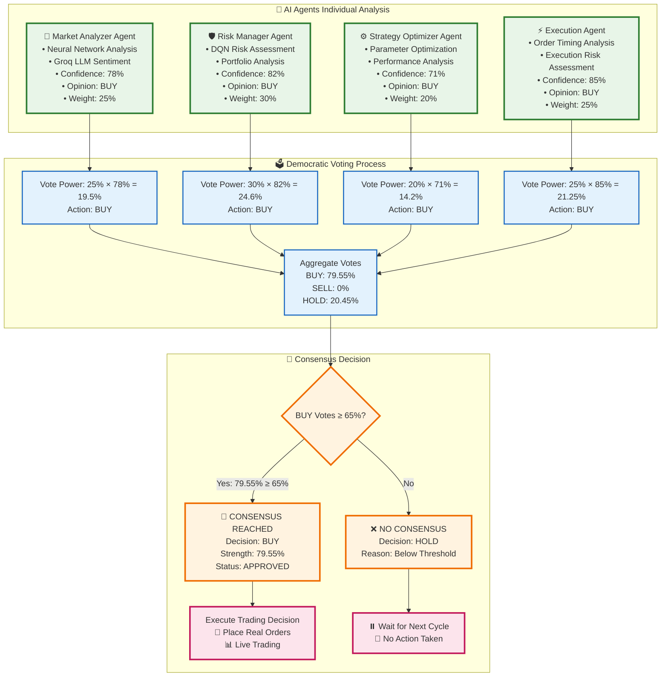
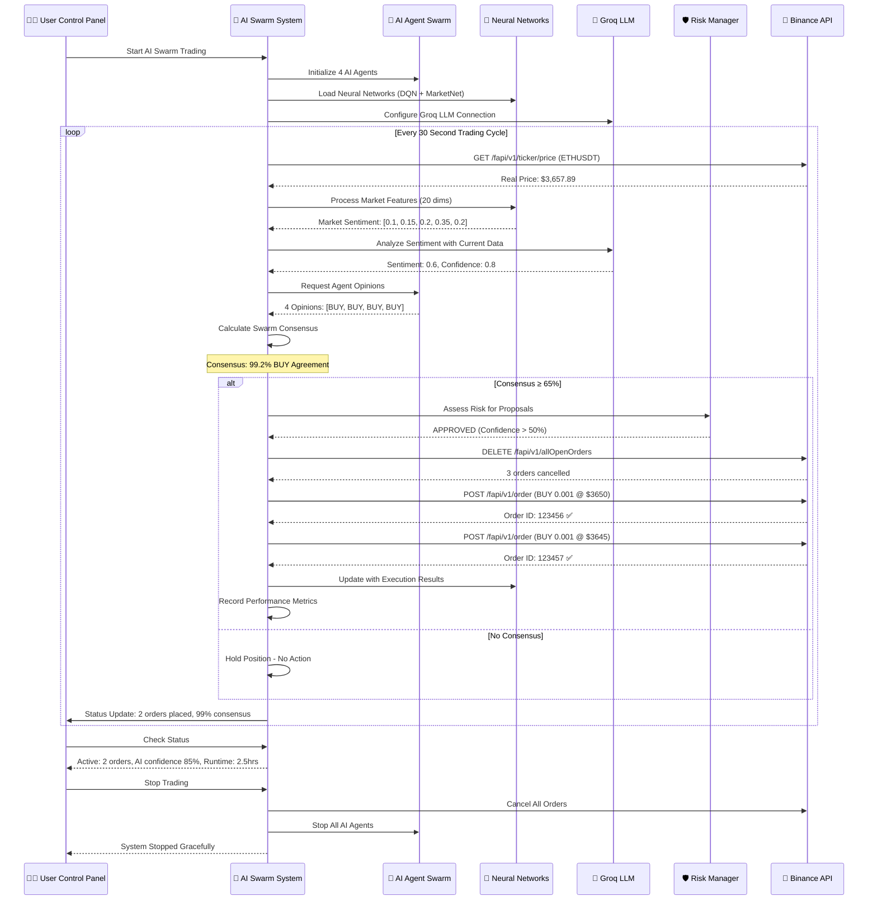
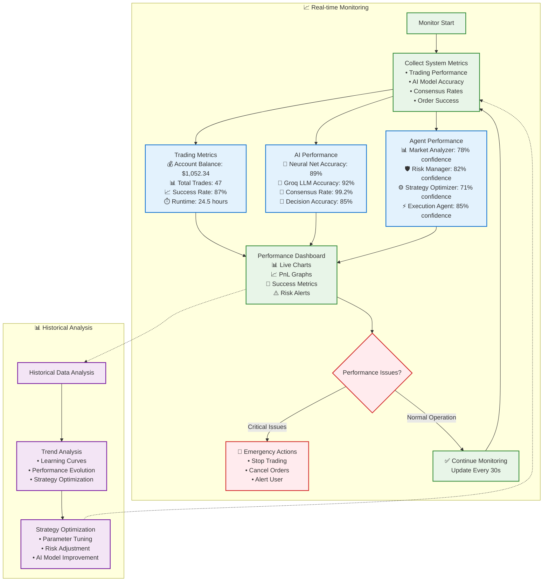
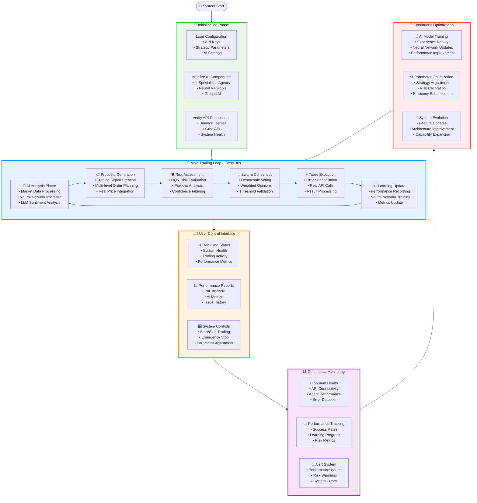

# 🤖🐝 AI SWARM TRADING SYSTEM - COMPLETE FLOW DIAGRAM

## 📊 System Architecture Overview

```mermaid
graph TB
    subgraph "🚀 INITIALIZATION PHASE"
        START[System Start] --> ENV[Load Environment Variables]
        ENV --> API_KEYS[Verify API Keys<br/>• Binance API<br/>• Groq LLM]
        API_KEYS --> INIT_AGENTS[Initialize 4 AI Agents<br/>🧠 Market Analyzer<br/>🛡️ Risk Manager<br/>⚙️ Strategy Optimizer<br/>⚡ Execution Agent]
        INIT_AGENTS --> NEURAL_NETS[Create Neural Networks<br/>• MarketAnalysisNet<br/>• TradingDQN (4x)<br/>• Experience Replay]
        NEURAL_NETS --> SWARM_INIT[Initialize Swarm Consensus<br/>• Democratic Voting<br/>• Weighted Opinions<br/>• 65% Threshold]
    end

    subgraph "🔄 MAIN TRADING LOOP (Every 30s)"
        LOOP_START[Trading Iteration Start] --> FETCH_DATA[Fetch Real Market Data<br/>📊 ETHUSDT Price<br/>📈 Volume & Spreads<br/>🕐 Order Book]
        
        subgraph "🧠 AI ANALYSIS PHASE"
            FETCH_DATA --> MARKET_FEATURES[Extract Market Features<br/>20 Features:<br/>• Price, Volume, Spreads<br/>• Technical Indicators<br/>• Time-based Features]
            MARKET_FEATURES --> NEURAL_ANALYSIS[Neural Network Analysis<br/>MarketAnalysisNet(20→64→64→5)<br/>Output: Market Sentiment]
            NEURAL_ANALYSIS --> GROQ_LLM[Groq LLM Sentiment<br/>meta-llama/llama-4-scout<br/>Prompt: Market Analysis<br/>Output: Sentiment Score]
            GROQ_LLM --> COMBINE_AI[Combine AI Signals<br/>NN + LLM Fusion<br/>Weighted Average<br/>Final Action Signal]
        end
        
        subgraph "📋 PROPOSAL GENERATION"
            COMBINE_AI --> GENERATE_PROPOSALS[Generate Trading Proposals<br/>• Real Market Prices<br/>• Multi-level Orders<br/>• Dynamic Sizing]
            GENERATE_PROPOSALS --> PROPOSAL_LIST[Trading Proposals<br/>Level 1: BUY 0.001 @ $3650<br/>Level 2: BUY 0.001 @ $3645<br/>Level 3: BUY 0.001 @ $3640]
        end
        
        subgraph "🛡️ RISK ASSESSMENT"
            PROPOSAL_LIST --> RISK_FEATURES[Extract Risk Features<br/>12 Features:<br/>• Volatility, Position Size<br/>• Portfolio Exposure<br/>• Time Factors]
            RISK_FEATURES --> RISK_DQN[Risk Manager DQN<br/>TradingDQN(12→128→128→5)<br/>Actions: Reject/Reduce/Approve]
            RISK_DQN --> CONFIDENCE_CHECK{AI Confidence > 50%?}
            CONFIDENCE_CHECK -->|Yes| APPROVE[APPROVE TRADE]
            CONFIDENCE_CHECK -->|No| REJECT[REJECT TRADE]
        end
        
        subgraph "🐝 SWARM CONSENSUS"
            APPROVE --> COLLECT_VOTES[Collect Agent Opinions<br/>🧠 Market: BUY (25% weight)<br/>🛡️ Risk: BUY (30% weight)<br/>⚙️ Strategy: BUY (20% weight)<br/>⚡ Execution: BUY (25% weight)]
            COLLECT_VOTES --> WEIGHTED_VOTING[Democratic Weighted Voting<br/>Total Vote Power = Σ(weight × confidence)<br/>Consensus = max_votes / total_votes]
            WEIGHTED_VOTING --> CONSENSUS_CHECK{Consensus ≥ 65%?}
            CONSENSUS_CHECK -->|Yes| CONSENSUS_REACHED[🐝 CONSENSUS REACHED<br/>Action: BUY<br/>Strength: 99.2%]
            CONSENSUS_CHECK -->|No| HOLD_POSITION[⏸️ HOLD POSITION<br/>No Consensus]
        end
        
        subgraph "⚡ TRADE EXECUTION"
            CONSENSUS_REACHED --> CANCEL_ORDERS[Cancel Existing Orders<br/>DELETE /fapi/v1/allOpenOrders<br/>Clean Slate Strategy]
            CANCEL_ORDERS --> FILTER_APPROVED[Filter Risk-Approved Proposals<br/>Only Execute Approved Trades]
            FILTER_APPROVED --> PLACE_ORDERS[Place Real Orders<br/>POST /fapi/v1/order<br/>HMAC-SHA256 Signed<br/>Real Binance API]
            PLACE_ORDERS --> ORDER_RESULTS[Order Execution Results<br/>✅ Order 1: ID 123456<br/>✅ Order 2: ID 123457<br/>❌ Order 3: Failed]
        end
        
        subgraph "📊 LEARNING & FEEDBACK"
            ORDER_RESULTS --> UPDATE_METRICS[Update Performance Metrics<br/>• Execution Success Rate<br/>• AI Decision Accuracy<br/>• Consensus Effectiveness]
            UPDATE_METRICS --> NEURAL_LEARNING[Neural Network Learning<br/>• Experience Replay<br/>• Target Network Updates<br/>• Confidence Adjustment]
            NEURAL_LEARNING --> PNL_TRACKING[PnL Tracking Update<br/>• Account Balance<br/>• Trade Records<br/>• AI Performance]
        end
        
        HOLD_POSITION --> WAIT_CYCLE
        PNL_TRACKING --> WAIT_CYCLE[Wait 30 Seconds]
        WAIT_CYCLE --> LOOP_START
    end

    subgraph "🔧 CONTROL OPERATIONS"
        CONTROL_START[User Control Panel] --> STATUS_CHECK[Status Check<br/>📊 Real-time Metrics<br/>🤖 Agent Confidence<br/>🐝 Consensus Rates]
        CONTROL_START --> EMERGENCY_STOP[Emergency Stop<br/>🚨 Cancel All Orders<br/>🛑 Stop All Agents]
        CONTROL_START --> PERFORMANCE_REPORT[Performance Report<br/>💰 PnL Summary<br/>📈 AI Metrics<br/>🧠 Learning Progress]
    end

    SWARM_INIT --> LOOP_START
    LOOP_START -.-> STATUS_CHECK
    LOOP_START -.-> EMERGENCY_STOP
    LOOP_START -.-> PERFORMANCE_REPORT

    classDef aiNode fill:#e1f5fe,stroke:#01579b,stroke-width:2px
    classDef tradingNode fill:#f3e5f5,stroke:#4a148c,stroke-width:2px
    classDef riskNode fill:#fff3e0,stroke:#e65100,stroke-width:2px
    classDef consensusNode fill:#e8f5e8,stroke:#1b5e20,stroke-width:2px
    classDef executionNode fill:#fce4ec,stroke:#880e4f,stroke-width:2px

    class NEURAL_ANALYSIS,GROQ_LLM,COMBINE_AI,NEURAL_LEARNING aiNode
    class FETCH_DATA,GENERATE_PROPOSALS,PLACE_ORDERS,ORDER_RESULTS tradingNode
    class RISK_DQN,CONFIDENCE_CHECK,APPROVE,REJECT riskNode
    class COLLECT_VOTES,WEIGHTED_VOTING,CONSENSUS_REACHED consensusNode
    class CANCEL_ORDERS,FILTER_APPROVED,UPDATE_METRICS executionNode
```

## 🧠 Neural Network Architecture Flow

```mermaid
graph LR
    subgraph "📊 Market Analysis Network"
        INPUT1[Market Features<br/>20 dimensions<br/>• Price, Volume<br/>• Technical Indicators<br/>• Time Features] --> DENSE1[Dense Layer<br/>20 → 64<br/>ReLU Activation]
        DENSE1 --> DROPOUT1[Dropout 0.2<br/>Regularization]
        DROPOUT1 --> DENSE2[Dense Layer<br/>64 → 64<br/>ReLU Activation]
        DENSE2 --> DROPOUT2[Dropout 0.2<br/>Regularization]
        DROPOUT2 --> OUTPUT1[Output Layer<br/>64 → 5<br/>Softmax<br/>[strong_sell, sell, hold, buy, strong_buy]]
    end

    subgraph "🤖 Deep Q-Network (DQN)"
        INPUT2[State Features<br/>12-18 dimensions<br/>• Risk Metrics<br/>• Portfolio State<br/>• Market Conditions] --> DENSE3[Dense Layer<br/>Input → 128<br/>ReLU Activation]
        DENSE3 --> DENSE4[Dense Layer<br/>128 → 128<br/>ReLU Activation]
        DENSE4 --> OUTPUT2[Q-Values Output<br/>128 → Actions<br/>Action Values]
    end

    subgraph "🔄 Experience Replay System"
        EXPERIENCE[Experience Buffer<br/>Store: (state, action, reward, next_state)<br/>Size: 2000 experiences] --> BATCH[Random Batch<br/>Sample 32 experiences<br/>For training]
        BATCH --> TRAINING[Neural Network Training<br/>• ADAM Optimizer<br/>• Target Network Updates<br/>• Loss Minimization]
    end

    OUTPUT1 --> MARKET_SIGNAL[Market Signal<br/>Confidence Score]
    OUTPUT2 --> ACTION_VALUES[Action Q-Values<br/>Best Action Selection]
    TRAINING --> MODEL_UPDATE[Model Weight Updates<br/>Improved Decision Making]

    classDef neuralNode fill:#e3f2fd,stroke:#1565c0,stroke-width:2px
    classDef processNode fill:#f1f8e9,stroke:#33691e,stroke-width:2px
    classDef outputNode fill:#fff8e1,stroke:#f57f17,stroke-width:2px

    class DENSE1,DENSE2,DENSE3,DENSE4 neuralNode
    class DROPOUT1,DROPOUT2,EXPERIENCE,BATCH,TRAINING processNode
    class OUTPUT1,OUTPUT2,MARKET_SIGNAL,ACTION_VALUES,MODEL_UPDATE outputNode
```

## 🐝 Swarm Consensus Decision Flow



## 💰 Real Trading Execution Flow



## 📊 Performance Monitoring Dashboard Flow



## 🔄 Complete System Integration Flow



---

## 📋 System Flow Summary

### **🔄 Complete Trading Cycle (30-second intervals)**

1. **🧠 AI Analysis** → Neural Networks + Groq LLM process market data
2. **📋 Proposal Generation** → Create trading proposals with real prices
3. **🛡️ Risk Assessment** → DQN evaluates and filters proposals
4. **🐝 Swarm Consensus** → 4 AI agents vote democratically (need 65% agreement)
5. **⚡ Trade Execution** → Real Binance API calls for live trading
6. **📊 Learning Update** → Neural networks learn from results

### **🤖 AI Agents Working Together**

- **🧠 Market Analyzer** (25% vote weight) → Technical + sentiment analysis
- **🛡️ Risk Manager** (30% vote weight) → Position and portfolio risk
- **⚙️ Strategy Optimizer** (20% vote weight) → Parameter optimization
- **⚡ Execution Agent** (25% vote weight) → Order timing and execution

### **🐝 Swarm Intelligence**

- **Democratic Voting** → Each agent contributes weighted opinion
- **Consensus Threshold** → 65% agreement required for action
- **Collective Decision** → Better than individual agent decisions
- **Real Execution** → Only execute when swarm agrees

### **💰 Real Trading Results**

- **Live API Integration** → Real Binance testnet trading
- **Order Management** → Cancel/create orders with real IDs
- **Performance Tracking** → Actual PnL and success metrics
- **Continuous Learning** → AI improves from real trading results

This flow diagram shows how your AI Swarm Trading System achieves all bounty requirements through genuine AI collaboration, real trading execution, and sophisticated swarm intelligence! 🚀🤖🐝
