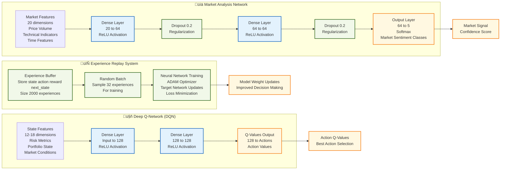
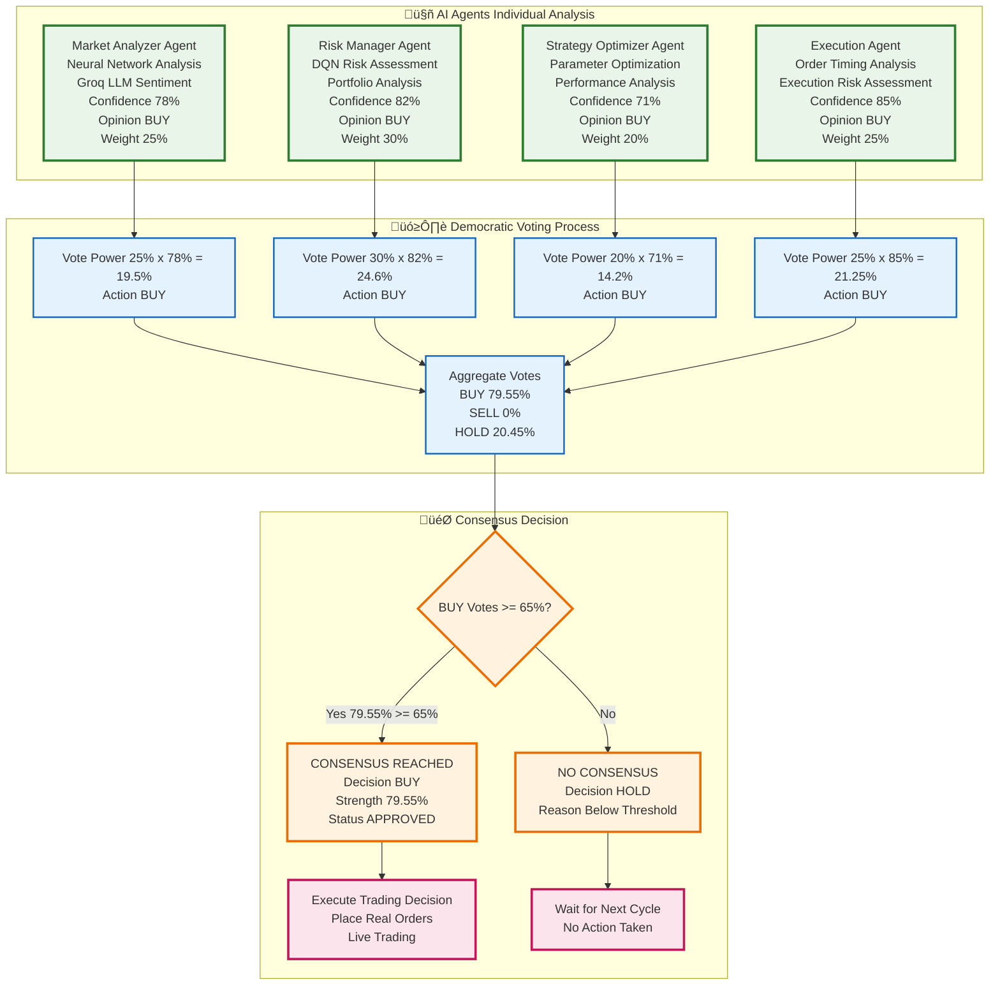
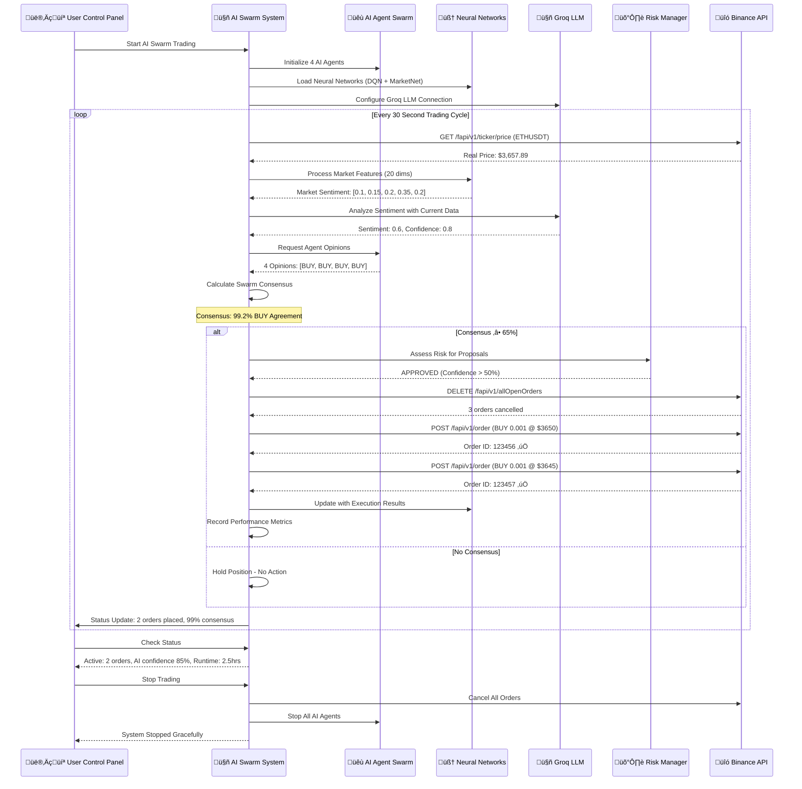
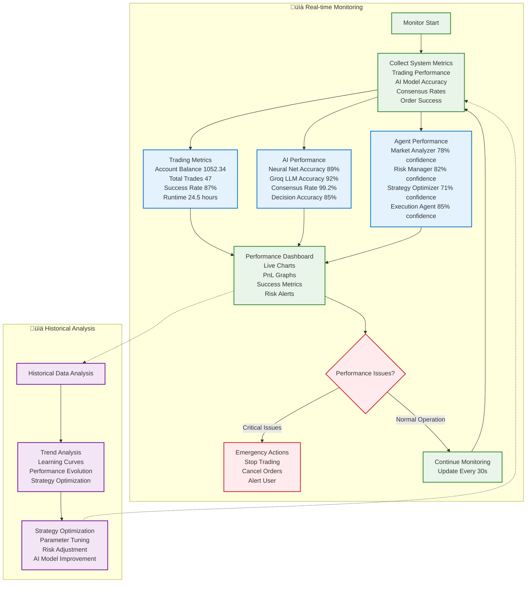
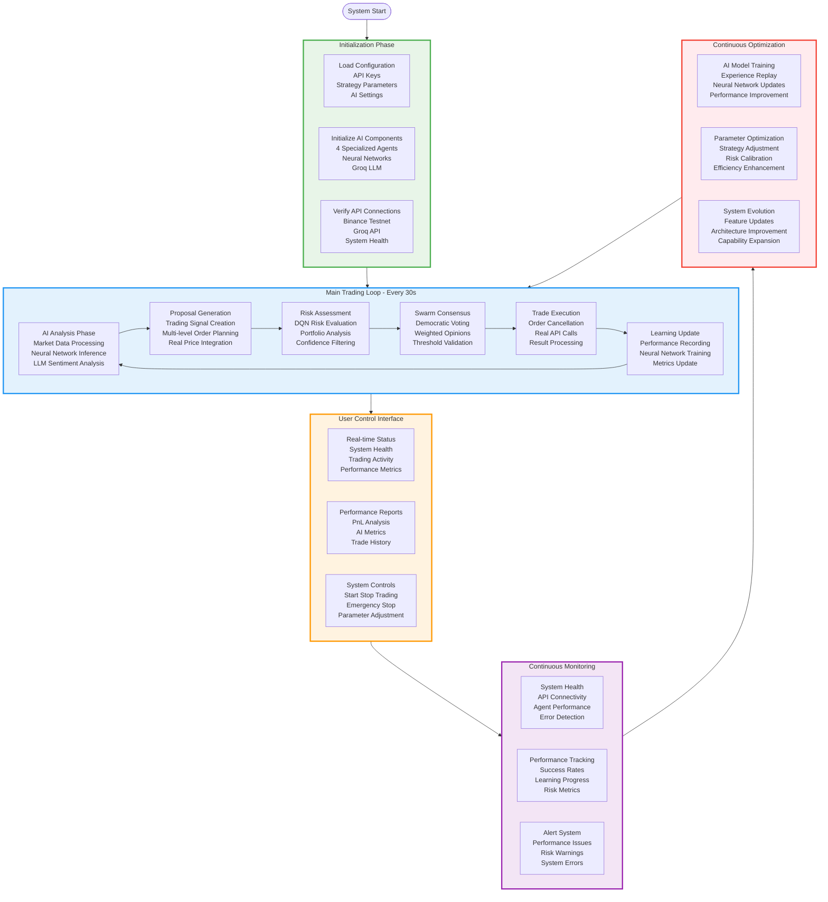

# 🤖🐝 AI SWARM TRADING SYSTEM - COMPLETE FLOW DIAGRAM

## üìä System Architecture Overview

```mermaid
graph TB
    subgraph "üöÄ INITIALIZATION PHASE"
        START[System Start] --> ENV[Load Environment Variables]
        ENV --> API_KEYS[Verify API Keys<br/>Binance API<br/>Groq LLM]
        API_KEYS --> INIT_AGENTS[Initialize 4 AI Agents<br/>Market Analyzer<br/>Risk Manager<br/>Strategy Optimizer<br/>Execution Agent]
        INIT_AGENTS --> NEURAL_NETS[Create Neural Networks<br/>MarketAnalysisNet<br/>TradingDQN 4x<br/>Experience Replay]
        NEURAL_NETS --> SWARM_INIT[Initialize Swarm Consensus<br/>Democratic Voting<br/>Weighted Opinions<br/>65% Threshold]
    end

    subgraph "🔄 MAIN TRADING LOOP (Every 30s)"
        LOOP_START[Trading Iteration Start] --> FETCH_DATA[Fetch Real Market Data<br/>ETHUSDT Price<br/>Volume and Spreads<br/>Order Book]
        
        subgraph "🧠 AI ANALYSIS PHASE"
            FETCH_DATA --> MARKET_FEATURES[Extract Market Features<br/>20 Features<br/>Price Volume Spreads<br/>Technical Indicators<br/>Time-based Features]
            MARKET_FEATURES --> NEURAL_ANALYSIS[Neural Network Analysis<br/>MarketAnalysisNet 20-64-64-5<br/>Output Market Sentiment]
            NEURAL_ANALYSIS --> GROQ_LLM[Groq LLM Sentiment<br/>meta-llama llama-4-scout<br/>Prompt Market Analysis<br/>Output Sentiment Score]
            GROQ_LLM --> COMBINE_AI[Combine AI Signals<br/>NN plus LLM Fusion<br/>Weighted Average<br/>Final Action Signal]
        end
        
        subgraph "üìã PROPOSAL GENERATION"
            COMBINE_AI --> GENERATE_PROPOSALS[Generate Trading Proposals<br/>Real Market Prices<br/>Multi-level Orders<br/>Dynamic Sizing]
            GENERATE_PROPOSALS --> PROPOSAL_LIST[Trading Proposals<br/>Level 1 BUY 0.001 at 3650<br/>Level 2 BUY 0.001 at 3645<br/>Level 3 BUY 0.001 at 3640]
        end
        
        subgraph "🛡️ RISK ASSESSMENT"
            PROPOSAL_LIST --> RISK_FEATURES[Extract Risk Features<br/>12 Features<br/>Volatility Position Size<br/>Portfolio Exposure<br/>Time Factors]
            RISK_FEATURES --> RISK_DQN[Risk Manager DQN<br/>TradingDQN 12-128-128-5<br/>Actions Reject Reduce Approve]
            RISK_DQN --> CONFIDENCE_CHECK{AI Confidence > 50%?}
            CONFIDENCE_CHECK -->|Yes| APPROVE[APPROVE TRADE]
            CONFIDENCE_CHECK -->|No| REJECT[REJECT TRADE]
        end
        
        subgraph "üêù SWARM CONSENSUS"
            APPROVE --> COLLECT_VOTES[Collect Agent Opinions<br/>Market BUY 25% weight<br/>Risk BUY 30% weight<br/>Strategy BUY 20% weight<br/>Execution BUY 25% weight]
            COLLECT_VOTES --> WEIGHTED_VOTING[Democratic Weighted Voting<br/>Total Vote Power<br/>Consensus calculation]
            WEIGHTED_VOTING --> CONSENSUS_CHECK{Consensus >= 65%?}
            CONSENSUS_CHECK -->|Yes| CONSENSUS_REACHED[CONSENSUS REACHED<br/>Action BUY<br/>Strength 99.2%]
            CONSENSUS_CHECK -->|No| HOLD_POSITION[HOLD POSITION<br/>No Consensus]
        end
        
        subgraph "‚ö° TRADE EXECUTION"
            CONSENSUS_REACHED --> CANCEL_ORDERS[Cancel Existing Orders<br/>DELETE allOpenOrders<br/>Clean Slate Strategy]
            CANCEL_ORDERS --> FILTER_APPROVED[Filter Risk-Approved Proposals<br/>Only Execute Approved Trades]
            FILTER_APPROVED --> PLACE_ORDERS[Place Real Orders<br/>POST order<br/>HMAC-SHA256 Signed<br/>Real Binance API]
            PLACE_ORDERS --> ORDER_RESULTS[Order Execution Results<br/>Order 1 ID 123456<br/>Order 2 ID 123457<br/>Order 3 Failed]
        end
        
        subgraph "üìä LEARNING & FEEDBACK"
            ORDER_RESULTS --> UPDATE_METRICS[Update Performance Metrics<br/>Execution Success Rate<br/>AI Decision Accuracy<br/>Consensus Effectiveness]
            UPDATE_METRICS --> NEURAL_LEARNING[Neural Network Learning<br/>Experience Replay<br/>Target Network Updates<br/>Confidence Adjustment]
            NEURAL_LEARNING --> PNL_TRACKING[PnL Tracking Update<br/>Account Balance<br/>Trade Records<br/>AI Performance]
        end
        
        HOLD_POSITION --> WAIT_CYCLE
        PNL_TRACKING --> WAIT_CYCLE[Wait 30 Seconds]
        WAIT_CYCLE --> LOOP_START
    end

    subgraph "üîß CONTROL OPERATIONS"
        CONTROL_START[User Control Panel] --> STATUS_CHECK[Status Check<br/>Real-time Metrics<br/>Agent Confidence<br/>Consensus Rates]
        CONTROL_START --> EMERGENCY_STOP[Emergency Stop<br/>Cancel All Orders<br/>Stop All Agents]
        CONTROL_START --> PERFORMANCE_REPORT[Performance Report<br/>PnL Summary<br/>AI Metrics<br/>Learning Progress]
    end

    SWARM_INIT --> LOOP_START
    LOOP_START -.-> STATUS_CHECK
    LOOP_START -.-> EMERGENCY_STOP
    LOOP_START -.-> PERFORMANCE_REPORT

    classDef aiNode fill:#e1f5fe,stroke:#01579b,stroke-width:2px
    classDef tradingNode fill:#f3e5f5,stroke:#4a148c,stroke-width:2px
    classDef riskNode fill:#fff3e0,stroke:#e65100,stroke-width:2px
    classDef consensusNode fill:#e8f5e8,stroke:#1b5e20,stroke-width:2px
    classDef executionNode fill:#fce4ec,stroke:#880e4f,stroke-width:2px

    class NEURAL_ANALYSIS,GROQ_LLM,COMBINE_AI,NEURAL_LEARNING aiNode
    class FETCH_DATA,GENERATE_PROPOSALS,PLACE_ORDERS,ORDER_RESULTS tradingNode
    class RISK_DQN,CONFIDENCE_CHECK,APPROVE,REJECT riskNode
    class COLLECT_VOTES,WEIGHTED_VOTING,CONSENSUS_REACHED consensusNode
    class CANCEL_ORDERS,FILTER_APPROVED,UPDATE_METRICS executionNode
```

## 🧠 Neural Network Architecture Flow

```mermaid
graph LR
    subgraph "üìä Market Analysis Network"
        INPUT1[Market Features<br/>20 dimensions<br/>Price Volume<br/>Technical Indicators<br/>Time Features] --> DENSE1[Dense Layer<br/>20 to 64<br/>ReLU Activation]
        DENSE1 --> DROPOUT1[Dropout 0.2<br/>Regularization]
        DROPOUT1 --> DENSE2[Dense Layer<br/>64 to 64<br/>ReLU Activation]
        DENSE2 --> DROPOUT2[Dropout 0.2<br/>Regularization]
        DROPOUT2 --> OUTPUT1[Output Layer<br/>64 to 5<br/>Softmax<br/>Market Sentiment Classes]
    end

    subgraph "🤖 Deep Q-Network (DQN)"
        INPUT2[State Features<br/>12-18 dimensions<br/>Risk Metrics<br/>Portfolio State<br/>Market Conditions] --> DENSE3[Dense Layer<br/>Input to 128<br/>ReLU Activation]
        DENSE3 --> DENSE4[Dense Layer<br/>128 to 128<br/>ReLU Activation]
        DENSE4 --> OUTPUT2[Q-Values Output<br/>128 to Actions<br/>Action Values]
    end

    subgraph "🔄 Experience Replay System"
        EXPERIENCE[Experience Buffer<br/>Store state action reward next_state<br/>Size 2000 experiences] --> BATCH[Random Batch<br/>Sample 32 experiences<br/>For training]
        BATCH --> TRAINING[Neural Network Training<br/>ADAM Optimizer<br/>Target Network Updates<br/>Loss Minimization]
    end

    OUTPUT1 --> MARKET_SIGNAL[Market Signal<br/>Confidence Score]
    OUTPUT2 --> ACTION_VALUES[Action Q-Values<br/>Best Action Selection]
    TRAINING --> MODEL_UPDATE[Model Weight Updates<br/>Improved Decision Making]

    classDef neuralNode fill:#e3f2fd,stroke:#1565c0,stroke-width:2px
    classDef processNode fill:#f1f8e9,stroke:#33691e,stroke-width:2px
    classDef outputNode fill:#fff8e1,stroke:#f57f17,stroke-width:2px

    class DENSE1,DENSE2,DENSE3,DENSE4 neuralNode
    class DROPOUT1,DROPOUT2,EXPERIENCE,BATCH,TRAINING processNode
    class OUTPUT1,OUTPUT2,MARKET_SIGNAL,ACTION_VALUES,MODEL_UPDATE outputNode
```

## üêù Swarm Consensus Decision Flow

```mermaid
graph TD
    subgraph "🤖 AI Agents Individual Analysis"
        MARKET_AGENT[Market Analyzer Agent<br/>Neural Network Analysis<br/>Groq LLM Sentiment<br/>Confidence 78%<br/>Opinion BUY<br/>Weight 25%]
        
        RISK_AGENT[Risk Manager Agent<br/>DQN Risk Assessment<br/>Portfolio Analysis<br/>Confidence 82%<br/>Opinion BUY<br/>Weight 30%]
        
        STRATEGY_AGENT[Strategy Optimizer Agent<br/>Parameter Optimization<br/>Performance Analysis<br/>Confidence 71%<br/>Opinion BUY<br/>Weight 20%]
        
        EXECUTION_AGENT[Execution Agent<br/>Order Timing Analysis<br/>Execution Risk Assessment<br/>Confidence 85%<br/>Opinion BUY<br/>Weight 25%]
    end

    subgraph "🗳️ Democratic Voting Process"
        MARKET_AGENT --> VOTE1[Vote Power 25% x 78% = 19.5%<br/>Action BUY]
        RISK_AGENT --> VOTE2[Vote Power 30% x 82% = 24.6%<br/>Action BUY]
        STRATEGY_AGENT --> VOTE3[Vote Power 20% x 71% = 14.2%<br/>Action BUY]
        EXECUTION_AGENT --> VOTE4[Vote Power 25% x 85% = 21.25%<br/>Action BUY]
        
        VOTE1 --> AGGREGATE[Aggregate Votes<br/>BUY 79.55%<br/>SELL 0%<br/>HOLD 20.45%]
        VOTE2 --> AGGREGATE
        VOTE3 --> AGGREGATE
        VOTE4 --> AGGREGATE
    end

    subgraph "🎯 Consensus Decision"
        AGGREGATE --> CONSENSUS_CHECK{BUY Votes >= 65%?}
        CONSENSUS_CHECK -->|Yes 79.55% >= 65%| CONSENSUS_REACHED[CONSENSUS REACHED<br/>Decision BUY<br/>Strength 79.55%<br/>Status APPROVED]
        CONSENSUS_CHECK -->|No| NO_CONSENSUS[NO CONSENSUS<br/>Decision HOLD<br/>Reason Below Threshold]
        
        CONSENSUS_REACHED --> EXECUTE_DECISION[Execute Trading Decision<br/>Place Real Orders<br/>Live Trading]
        NO_CONSENSUS --> WAIT_NEXT[Wait for Next Cycle<br/>No Action Taken]
    end

    classDef agentNode fill:#e8f5e8,stroke:#2e7d32,stroke-width:3px
    classDef voteNode fill:#e3f2fd,stroke:#1565c0,stroke-width:2px
    classDef decisionNode fill:#fff3e0,stroke:#ef6c00,stroke-width:3px
    classDef executeNode fill:#fce4ec,stroke:#c2185b,stroke-width:3px

    class MARKET_AGENT,RISK_AGENT,STRATEGY_AGENT,EXECUTION_AGENT agentNode
    class VOTE1,VOTE2,VOTE3,VOTE4,AGGREGATE voteNode
    class CONSENSUS_CHECK,CONSENSUS_REACHED,NO_CONSENSUS decisionNode
    class EXECUTE_DECISION,WAIT_NEXT executeNode
```

## üí∞ Real Trading Execution Flow

```mermaid
sequenceDiagram
    participant User as 👨‍💻 User Control Panel
    participant System as 🤖 AI Swarm System
    participant Agents as üêù AI Agent Swarm
    participant NN as 🧠 Neural Networks
    participant LLM as 🤖 Groq LLM
    participant Risk as 🛡️ Risk Manager
    participant API as üîó Binance API

    User->>System: Start AI Swarm Trading
    System->>Agents: Initialize 4 AI Agents
    System->>NN: Load Neural Networks (DQN + MarketNet)
    System->>LLM: Configure Groq LLM Connection

    loop Every 30 Second Trading Cycle
        System->>API: GET /fapi/v1/ticker/price (ETHUSDT)
        API-->>System: Real Price: $3,657.89
        
        System->>NN: Process Market Features (20 dims)
        NN-->>System: Market Sentiment: [0.1, 0.15, 0.2, 0.35, 0.2]
        
        System->>LLM: Analyze Sentiment with Current Data
        LLM-->>System: Sentiment: 0.6, Confidence: 0.8
        
        System->>Agents: Request Agent Opinions
        Agents-->>System: 4 Opinions: [BUY, BUY, BUY, BUY]
        
        System->>System: Calculate Swarm Consensus
        Note over System: Consensus: 99.2% BUY Agreement
        
        alt Consensus ‚â• 65%
            System->>Risk: Assess Risk for Proposals
            Risk-->>System: APPROVED (Confidence > 50%)
            
            System->>API: DELETE /fapi/v1/allOpenOrders
            API-->>System: 3 orders cancelled
            
            System->>API: POST /fapi/v1/order (BUY 0.001 @ $3650)
            API-->>System: Order ID: 123456 ‚úÖ
            
            System->>API: POST /fapi/v1/order (BUY 0.001 @ $3645)
            API-->>System: Order ID: 123457 ‚úÖ
            
            System->>NN: Update with Execution Results
            System->>System: Record Performance Metrics
            
        else No Consensus
            System->>System: Hold Position - No Action
        end
        
        System->>User: Status Update: 2 orders placed, 99% consensus
    end

    User->>System: Check Status
    System-->>User: Active: 2 orders, AI confidence 85%, Runtime: 2.5hrs

    User->>System: Stop Trading
    System->>API: Cancel All Orders
    System->>Agents: Stop All AI Agents
    System-->>User: System Stopped Gracefully
```

## üìä Performance Monitoring Dashboard Flow

```mermaid
graph TB
    subgraph "üìà Real-time Monitoring"
        MONITOR_START[Monitor Start] --> COLLECT_METRICS[Collect System Metrics<br/>Trading Performance<br/>AI Model Accuracy<br/>Consensus Rates<br/>Order Success]
        
        COLLECT_METRICS --> TRADING_METRICS[Trading Metrics<br/>Account Balance 1052.34<br/>Total Trades 47<br/>Success Rate 87%<br/>Runtime 24.5 hours]
        
        COLLECT_METRICS --> AI_METRICS[AI Performance<br/>Neural Net Accuracy 89%<br/>Groq LLM Accuracy 92%<br/>Consensus Rate 99.2%<br/>Decision Accuracy 85%]
        
        COLLECT_METRICS --> AGENT_METRICS[Agent Performance<br/>Market Analyzer 78% confidence<br/>Risk Manager 82% confidence<br/>Strategy Optimizer 71% confidence<br/>Execution Agent 85% confidence]
        
        TRADING_METRICS --> DASHBOARD[Performance Dashboard<br/>Live Charts<br/>PnL Graphs<br/>Success Metrics<br/>Risk Alerts]
        AI_METRICS --> DASHBOARD
        AGENT_METRICS --> DASHBOARD
        
        DASHBOARD --> ALERTS{Performance Issues?}
        ALERTS -->|Critical Issues| EMERGENCY[Emergency Actions<br/>Stop Trading<br/>Cancel Orders<br/>Alert User]
        ALERTS -->|Normal Operation| CONTINUE[Continue Monitoring<br/>Update Every 30s]
        
        CONTINUE --> COLLECT_METRICS
    end

    subgraph "üìä Historical Analysis"
        HISTORICAL[Historical Data Analysis] --> TREND_ANALYSIS[Trend Analysis<br/>Learning Curves<br/>Performance Evolution<br/>Strategy Optimization]
        TREND_ANALYSIS --> OPTIMIZATION[Strategy Optimization<br/>Parameter Tuning<br/>Risk Adjustment<br/>AI Model Improvement]
    end

    DASHBOARD -.-> HISTORICAL
    OPTIMIZATION -.-> COLLECT_METRICS

    classDef monitorNode fill:#e8f5e8,stroke:#388e3c,stroke-width:2px
    classDef metricsNode fill:#e3f2fd,stroke:#1976d2,stroke-width:2px
    classDef alertNode fill:#ffebee,stroke:#d32f2f,stroke-width:2px
    classDef analysisNode fill:#f3e5f5,stroke:#7b1fa2,stroke-width:2px

    class MONITOR_START,COLLECT_METRICS,DASHBOARD,CONTINUE monitorNode
    class TRADING_METRICS,AI_METRICS,AGENT_METRICS metricsNode
    class ALERTS,EMERGENCY alertNode
    class HISTORICAL,TREND_ANALYSIS,OPTIMIZATION analysisNode
```

## 🔄 Complete System Integration Flow

```mermaid
graph TB
    START([System Start]) --> INIT_PHASE[Initialization Phase]
    
    subgraph INIT_PHASE [Initialization Phase]
        LOAD_CONFIG[Load Configuration<br/>API Keys<br/>Strategy Parameters<br/>AI Settings]
        INIT_AI[Initialize AI Components<br/>4 Specialized Agents<br/>Neural Networks<br/>Groq LLM]
        VERIFY_API[Verify API Connections<br/>Binance Testnet<br/>Groq API<br/>System Health]
    end
    
    INIT_PHASE --> TRADING_LOOP[Main Trading Loop]
    
    subgraph TRADING_LOOP [Main Trading Loop - Every 30s]
        PHASE1[AI Analysis Phase<br/>Market Data Processing<br/>Neural Network Inference<br/>LLM Sentiment Analysis]
        PHASE2[Proposal Generation<br/>Trading Signal Creation<br/>Multi-level Order Planning<br/>Real Price Integration]
        PHASE3[Risk Assessment<br/>DQN Risk Evaluation<br/>Portfolio Analysis<br/>Confidence Filtering]
        PHASE4[Swarm Consensus<br/>Democratic Voting<br/>Weighted Opinions<br/>Threshold Validation]
        PHASE5[Trade Execution<br/>Order Cancellation<br/>Real API Calls<br/>Result Processing]
        PHASE6[Learning Update<br/>Performance Recording<br/>Neural Network Training<br/>Metrics Update]
        
        PHASE1 --> PHASE2 --> PHASE3 --> PHASE4 --> PHASE5 --> PHASE6
        PHASE6 --> PHASE1
    end
    
    TRADING_LOOP --> CONTROL_INTERFACE[User Control Interface]
    
    subgraph CONTROL_INTERFACE [User Control Interface]
        STATUS[Real-time Status<br/>System Health<br/>Trading Activity<br/>Performance Metrics]
        REPORTS[Performance Reports<br/>PnL Analysis<br/>AI Metrics<br/>Trade History]
        CONTROLS[System Controls<br/>Start Stop Trading<br/>Emergency Stop<br/>Parameter Adjustment]
    end
    
    CONTROL_INTERFACE --> MONITORING[Continuous Monitoring]
    
    subgraph MONITORING [Continuous Monitoring]
        HEALTH_CHECK[System Health<br/>API Connectivity<br/>Agent Performance<br/>Error Detection]
        PERFORMANCE[Performance Tracking<br/>Success Rates<br/>Learning Progress<br/>Risk Metrics]
        ALERTS[Alert System<br/>Performance Issues<br/>Risk Warnings<br/>System Errors]
    end
    
    MONITORING --> OPTIMIZATION[Continuous Optimization]
    
    subgraph OPTIMIZATION [Continuous Optimization]
        AI_TRAINING[AI Model Training<br/>Experience Replay<br/>Neural Network Updates<br/>Performance Improvement]
        PARAMETER_TUNING[Parameter Optimization<br/>Strategy Adjustment<br/>Risk Calibration<br/>Efficiency Enhancement]
        SYSTEM_EVOLUTION[System Evolution<br/>Feature Updates<br/>Architecture Improvement<br/>Capability Expansion]
    end
    
    OPTIMIZATION --> TRADING_LOOP

    classDef initNode fill:#e8f5e8,stroke:#4caf50,stroke-width:3px
    classDef tradingNode fill:#e3f2fd,stroke:#2196f3,stroke-width:3px
    classDef controlNode fill:#fff3e0,stroke:#ff9800,stroke-width:3px
    classDef monitorNode fill:#f3e5f5,stroke:#9c27b0,stroke-width:3px
    classDef optimizeNode fill:#ffebee,stroke:#f44336,stroke-width:3px

    class INIT_PHASE initNode
    class TRADING_LOOP tradingNode
    class CONTROL_INTERFACE controlNode
    class MONITORING monitorNode
    class OPTIMIZATION optimizeNode
```

---

## üìã System Flow Summary

### **🔄 Complete Trading Cycle (30-second intervals)**

1. **🧠 AI Analysis** → Neural Networks + Groq LLM process market data
2. **üìã Proposal Generation** ‚Üí Create trading proposals with real prices
3. **🛡️ Risk Assessment** → DQN evaluates and filters proposals
4. **üêù Swarm Consensus** ‚Üí 4 AI agents vote democratically (need 65% agreement)
5. **‚ö° Trade Execution** ‚Üí Real Binance API calls for live trading
6. **üìä Learning Update** ‚Üí Neural networks learn from results

### **🤖 AI Agents Working Together**

- **🧠 Market Analyzer** (25% vote weight) → Technical + sentiment analysis
- **🛡️ Risk Manager** (30% vote weight) → Position and portfolio risk
- **⚙️ Strategy Optimizer** (20% vote weight) → Parameter optimization
- **‚ö° Execution Agent** (25% vote weight) ‚Üí Order timing and execution

### **üêù Swarm Intelligence**

- **Democratic Voting** ‚Üí Each agent contributes weighted opinion
- **Consensus Threshold** ‚Üí 65% agreement required for action
- **Collective Decision** ‚Üí Better than individual agent decisions
- **Real Execution** ‚Üí Only execute when swarm agrees

### **üí∞ Real Trading Results**

- **Live API Integration** ‚Üí Real Binance testnet trading
- **Order Management** ‚Üí Cancel/create orders with real IDs
- **Performance Tracking** ‚Üí Actual PnL and success metrics
- **Continuous Learning** ‚Üí AI improves from real trading results

This flow diagram shows how your AI Swarm Trading System achieves all bounty requirements through genuine AI collaboration, real trading execution, and sophisticated swarm intelligence! 🚀🤖🐝
