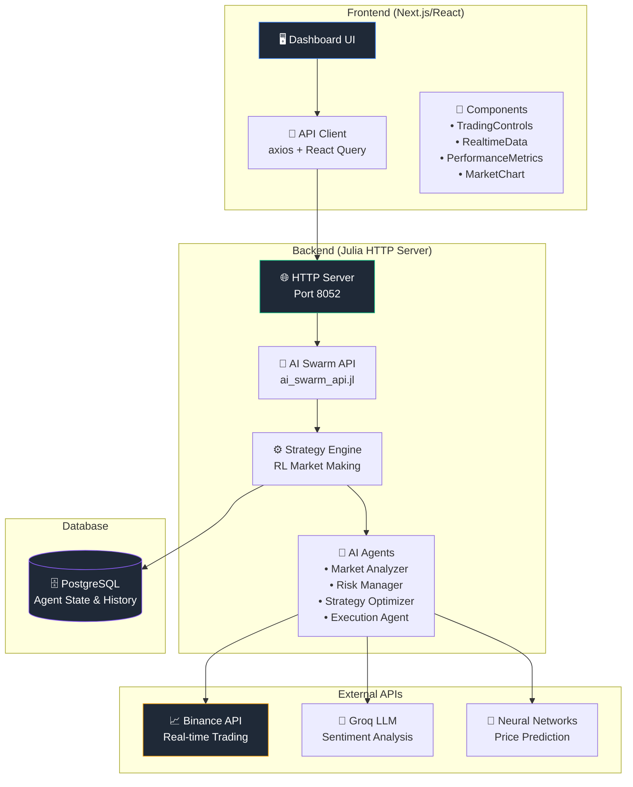
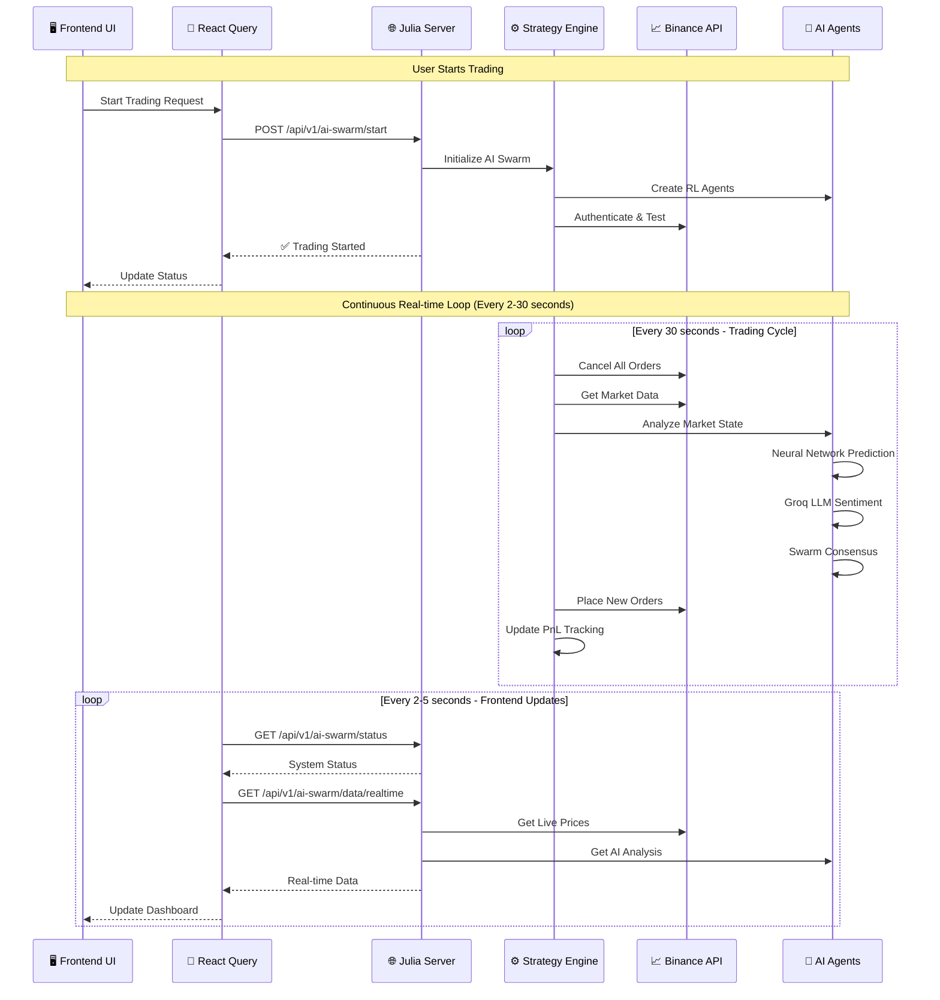
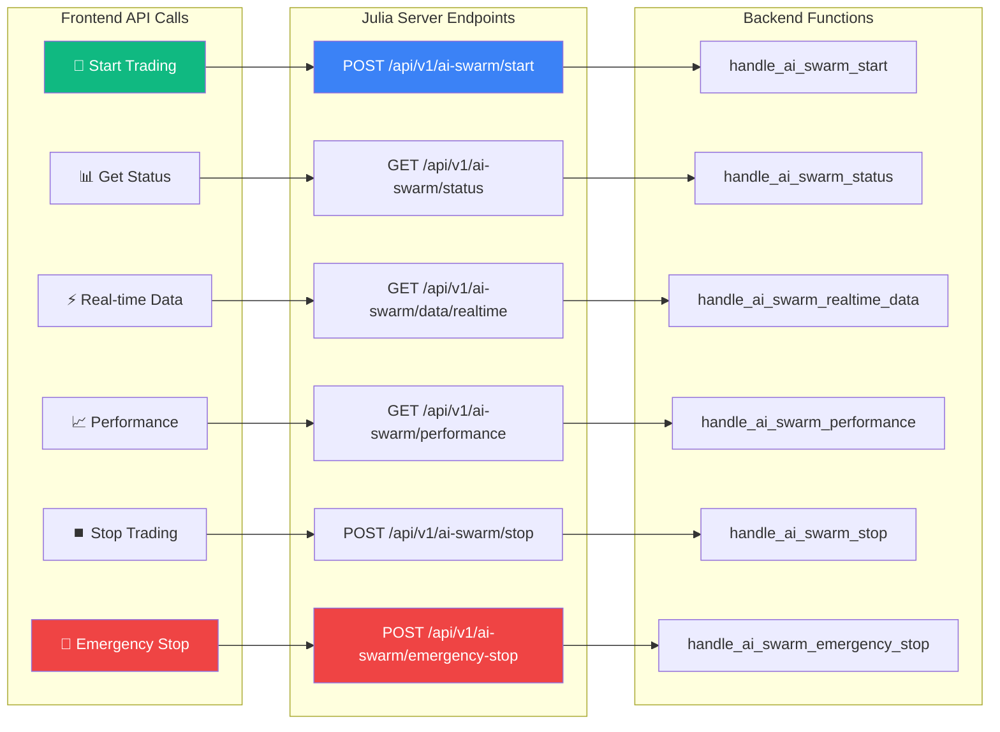
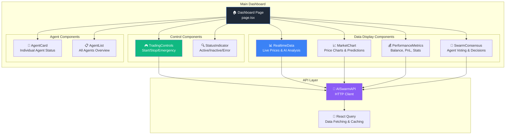
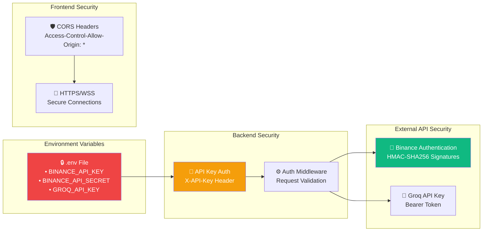
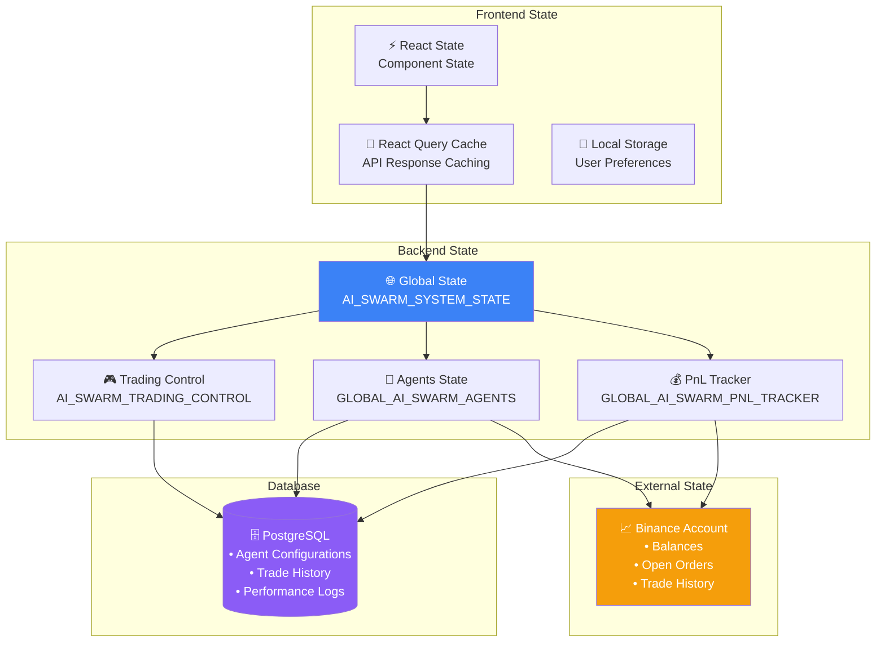

# 🤖🐝 AI Swarm Trading System - Architecture Diagrams

## 📊 **System Overview Architecture**



## 🔄 **Real-time Data Flow**



## 🏗️ **API Endpoint Architecture**



## 🤖 **AI Agent System Flow**

```mermaid
graph TD
    subgraph "AI Swarm Intelligence"
        MA[🔍 Market Analyzer<br/>• Price Pattern Analysis<br/>• Volume Analysis<br/>• Technical Indicators]
        RM[⚠️ Risk Manager<br/>• Position Sizing<br/>• Drawdown Control<br/>• Stop Loss Logic]
        SO[🎯 Strategy Optimizer<br/>• Parameter Tuning<br/>• Performance Optimization<br/>• Learning Rate Adjustment]
        EA[⚡ Execution Agent<br/>• Order Placement<br/>• Timing Optimization<br/>• Slippage Minimization]
    end
    
    subgraph "AI Technologies"
        NN[🧠 Neural Networks<br/>• Deep Q-Network (DQN)<br/>• Price Prediction<br/>• Pattern Recognition]
        LLM[💭 Groq LLM<br/>• News Sentiment<br/>• Market Analysis<br/>• Natural Language Processing]
        RL[🔄 Reinforcement Learning<br/>• Experience Replay<br/>• Q-Learning<br/>• Action Selection]
    end
    
    subgraph "Swarm Consensus"
        VOTE[🗳️ Voting System]
        CONSENSUS[🤝 Consensus Engine]
        DECISION[✅ Final Decision]
    end
    
    subgraph "Market Data"
        PRICE[💹 Live Prices]
        VOLUME[📊 Volume Data]
        ORDERBOOK[📋 Order Book]
    end
    
    PRICE --> MA
    VOLUME --> MA
    ORDERBOOK --> MA
    
    MA --> NN
    MA --> LLM
    NN --> RL
    LLM --> RL
    
    MA --> VOTE
    RM --> VOTE
    SO --> VOTE
    EA --> VOTE
    
    VOTE --> CONSENSUS
    CONSENSUS --> DECISION
    DECISION --> EA
    
    style MA fill:#3b82f6,color:#ffffff
    style RM fill:#ef4444,color:#ffffff
    style SO fill:#8b5cf6,color:#ffffff
    style EA fill:#10b981,color:#ffffff
    style NN fill:#f59e0b,color:#ffffff
    style CONSENSUS fill:#06b6d4,color:#ffffff
```

## 📱 **Frontend Component Hierarchy**



## ⚡ **Real-time Update Frequencies**

```mermaid
gantt
    title Real-time Data Update Schedule
    dateFormat X
    axisFormat %Ss
    
    section Frontend Polling
    System Status (5s)     :active, status, 0, 5
    Status Update          :status, 5, 10
    Status Update          :status, 10, 15
    Status Update          :status, 15, 20
    Status Update          :status, 20, 25
    Status Update          :status, 25, 30
    
    section Market Data (2s when trading)
    Real-time Data         :crit, realtime, 0, 2
    Data Update            :realtime, 2, 4
    Data Update            :realtime, 4, 6
    Data Update            :realtime, 6, 8
    Data Update            :realtime, 8, 10
    Data Update            :realtime, 10, 12
    
    section Performance (10s)
    Performance Metrics    :milestone, perf, 0, 10
    Metrics Update         :perf, 10, 20
    Metrics Update         :perf, 20, 30
    
    section Backend Trading Cycles (30s)
    Trading Cycle 1        :done, trade1, 0, 30
    Trading Cycle 2        :active, trade2, 30, 60
```



## 🔐 **Authentication & Security Flow**



## 🗄️ **Data Storage & State Management**



This comprehensive visual guide shows exactly how your AI Swarm Trading System works:

1. **🖥️ Frontend**: React dashboard with real-time components
2. **📡 API Communication**: RESTful endpoints with automatic polling
3. **⚙️ Backend Engine**: Julia server running AI strategies
4. **🤖 AI Agents**: Four specialized agents working together
5. **📈 Live Trading**: Real-time order management on Binance
6. **🔄 Data Flow**: Continuous 2-30 second update cycles

The system provides a complete real-time trading experience where AI makes decisions and the frontend shows everything happening live!
