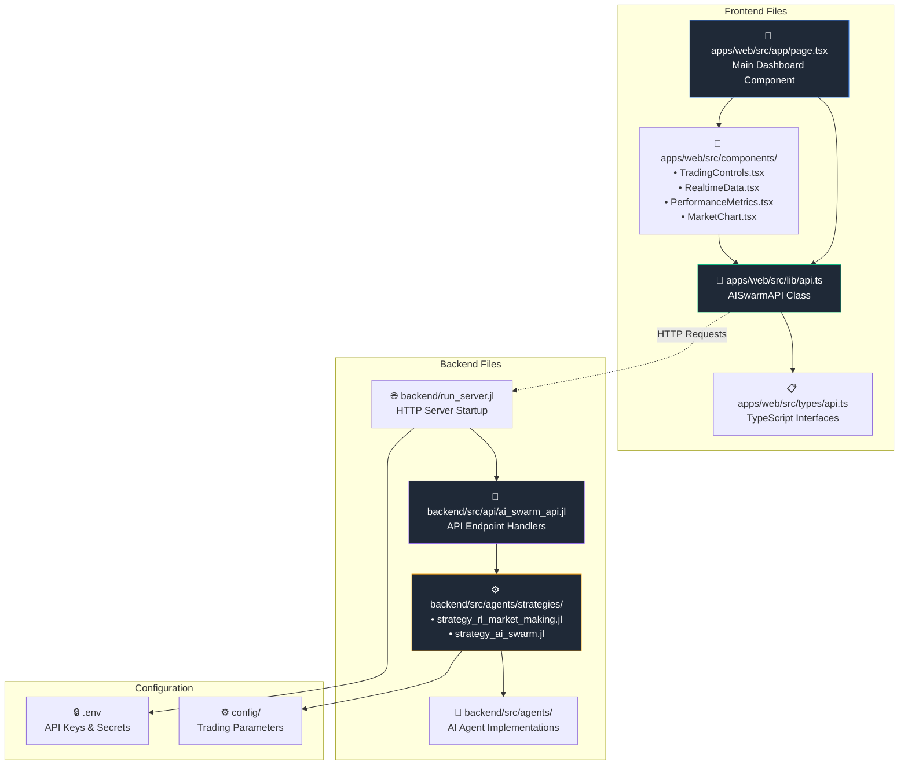
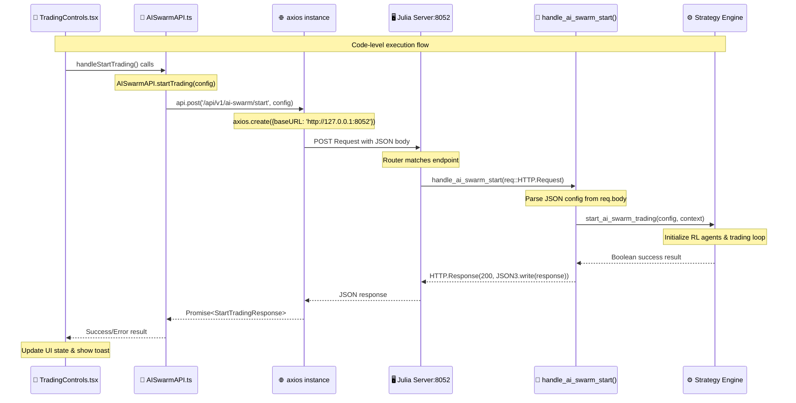
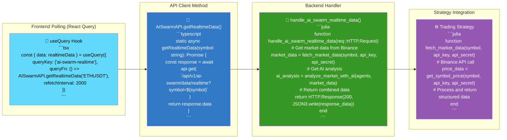
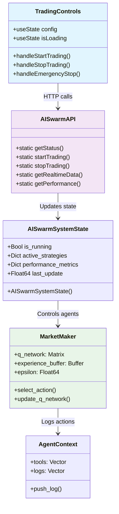
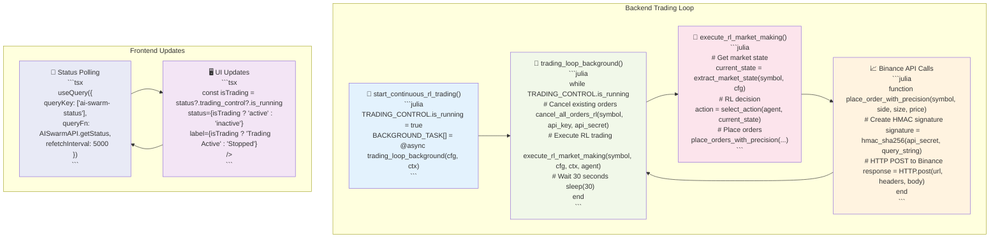
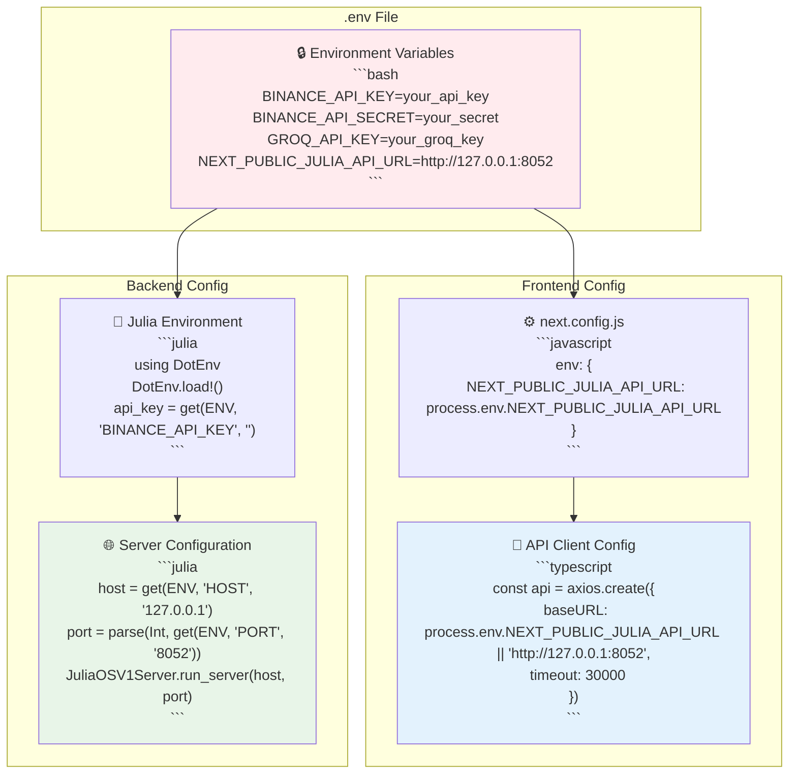
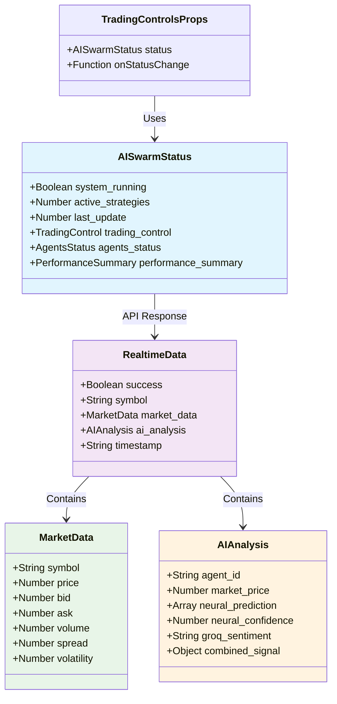

# 💻 **Code-Level Implementation Details**

## 🔗 **Frontend-Backend Code Connections**

### 📁 **File Structure & Connections**

### 🔄 **API Call Implementation**

### 📊 **Real-time Data Flow Code**

### 🤖 **AI Agent Code Structure**

### 📈 **Trading Loop Implementation**

### 🔐 **Environment & Configuration**

### 📊 **Data Type Definitions**

This code-level diagram shows:

1. **📁 Exact file connections** between frontend and backend
2. **🔄 Implementation details** of API calls and handlers  
3. **🤖 Code structure** of AI agents and trading loops
4. **📈 Real-time execution flow** with actual code snippets
5. **🔐 Configuration management** across environments
6. **📊 Data type definitions** and interfaces

The diagrams show exactly how your TypeScript frontend communicates with your Julia backend through HTTP APIs to execute real-time AI trading strategies!
