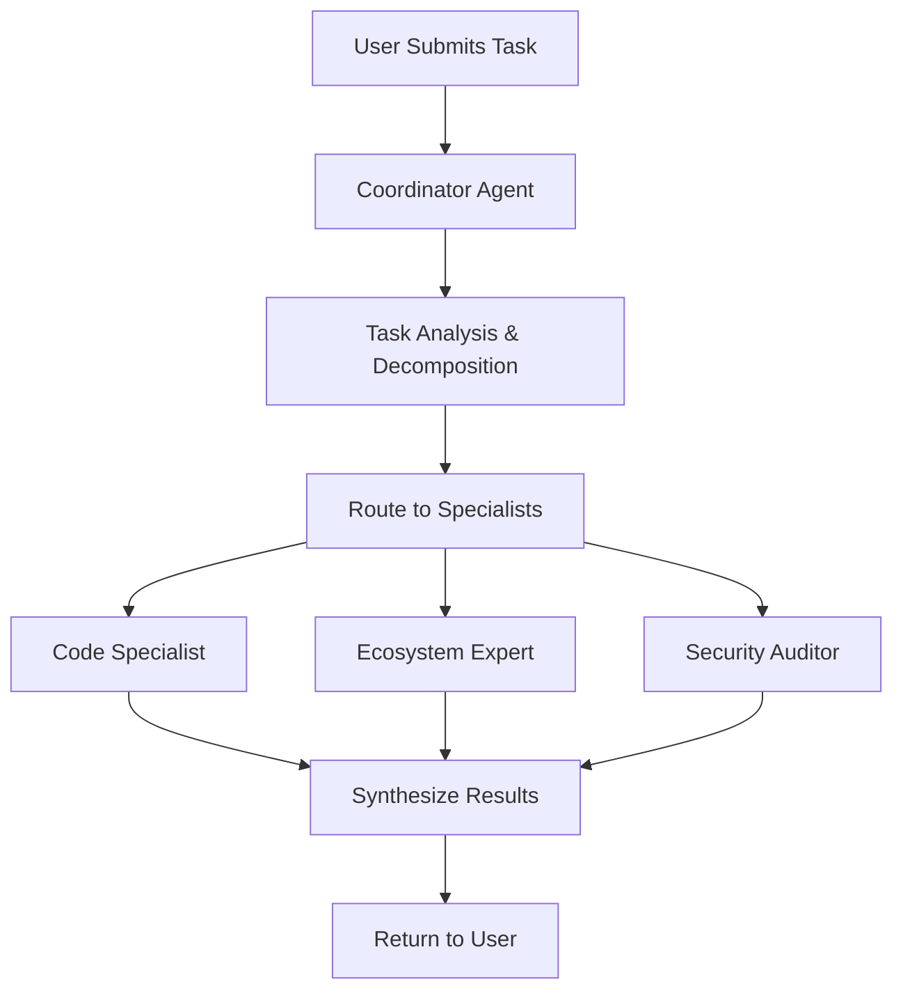

# 🔥 Custom Solana Julia Agent System Architecture

## 📋 **Overview**

Your **JuliaOS** is a sophisticated multi-agent framework specifically designed for Solana blockchain development. It combines **Julia's high-performance computing** with **AI-powered agent coordination** to create a powerful development environment for complex Solana projects.

---

## 🏗️ **System Architecture**

### **Core Components Hierarchy**

```
JuliaOS/
├── 🧠 Backend (Julia Server)         # Core agent engine
├── 🌐 Web Interface (HTML/JS)        # User interaction layer  
├── 🗄️ Database (PostgreSQL)          # State persistence
├── 🐍 Python Wrapper (Optional)      # Multi-language support
└── 📡 API Layer (REST)              # Communication bridge
```

---

## 🤖 **Agent System Architecture**

### **1. Agent Creation & Registration Process**

#### **Step 1: Agent Definition Structure**
```julia
# Located in: backend/src/agents/CommonTypes.jl
struct Agent
    id::String                    # Unique identifier
    name::String                  # Human-readable name
    description::String           # Purpose description
    context::AgentContext         # Runtime environment
    strategy::InstantiatedStrategy # Core behavior logic
    trigger::TriggerConfig        # Activation mechanism
    state::AgentState            # Current operational state
end
```

#### **Step 2: Strategy Registration**
```julia
# Located in: backend/src/agents/strategies/Strategies.jl
const STRATEGY_REGISTRY = Dict{String, StrategySpecification}()

# All strategies must be registered here:
register_strategy(STRATEGY_SOLANA_SWARM_DEV_SPECIFICATION)
register_strategy(STRATEGY_SOLANA_DEV_CHAT_SPECIFICATION)
register_strategy(STRATEGY_PLAN_AND_EXECUTE_SPECIFICATION)
# ... more strategies
```

#### **Step 3: Tool Registration**
```julia
# Located in: backend/src/agents/tools/Tools.jl
const TOOL_REGISTRY = Dict{String, ToolSpecification}()

# All tools must be registered here:
register_tool(TOOL_SOLANA_KNOWLEDGE_MULTI_MODEL_SPECIFICATION)
register_tool(TOOL_SOLANA_CODE_GEN_SPECIFICATION)
register_tool(TOOL_SOLANA_ECOSYSTEM_SPECIFICATION)
# ... more tools
```

### **2. Specialized Solana Agent Types**

#### **🎯 Coordinator Agent (`coordinator`)**
- **Role**: Task decomposition and orchestration
- **Capabilities**: 
  - Breaks down complex tasks into subtasks
  - Routes work to specialized agents
  - Synthesizes results from multiple agents
  - Manages swarm coordination

#### **💻 Code Specialist Agent (`code_specialist`)**
- **Role**: Smart contract development
- **Capabilities**:
  - Anchor program development
  - Client-side integration code
  - Testing framework setup
  - Code optimization

#### **🌐 Ecosystem Expert Agent (`ecosystem_expert`)**
- **Role**: DeFi and ecosystem integration
- **Capabilities**:
  - DeFi protocol integration
  - Token program interactions
  - Cross-chain bridge knowledge
  - Ecosystem best practices

#### **🔒 Security Auditor Agent (`security_auditor`)**
- **Role**: Security analysis and auditing
- **Capabilities**:
  - Smart contract vulnerability scanning
  - Security best practices enforcement
  - Risk assessment
  - Audit report generation

---

## 🔧 **Agent Creation Process**

### **Method 1: Programmatic Creation (Julia)**

```julia
# 1. Define Agent Blueprint
blueprint = AgentBlueprint(
    tools=[
        ToolBlueprint("solana_knowledge_multi_model", config),
        ToolBlueprint("solana_code_gen", config)
    ],
    strategy=StrategyBlueprint("solana_swarm_dev", strategy_config),
    trigger=TriggerConfig(WEBHOOK_TRIGGER, webhook_params)
)

# 2. Create Agent Instance
agent = create_agent(
    "solana_dev_001",           # Unique ID
    "Solana Developer Agent",    # Name
    "Expert Solana development assistant", # Description
    blueprint                    # Configuration
)

# 3. Agent is automatically registered in AGENTS registry
```

### **Method 2: REST API Creation**

```bash
# POST to backend server
curl -X POST http://127.0.0.1:8052/agents \
  -H "Content-Type: application/json" \
  -d '{
    "id": "solana_coordinator_001",
    "name": "Solana Swarm Coordinator",
    "description": "Coordinates multiple Solana development specialists",
    "blueprint": {
      "tools": [
        {
          "name": "solana_knowledge_multi_model",
          "config": {"model_preference": "groq"}
        }
      ],
      "strategy": {
        "name": "solana_swarm_dev",
        "config": {
          "agent_role": "coordinator",
          "max_iterations": 5
        }
      },
      "trigger": {
        "type": "WEBHOOK",
        "params": {}
      }
    }
  }'
```

---

## 🚀 **How to Access Your System**

### **1. Start the Backend Server**

```bash
# Navigate to backend directory
cd backend/

# Start Julia server (automatically loads agents)
julia run_server.jl
```

**Server Details:**
- **Host**: `127.0.0.1` (localhost)
- **Port**: `8052`
- **API Base**: `http://127.0.0.1:8052/api/v1`

### **2. Start the Web Interface**

```bash
# Navigate to web directory
cd web/

# Start Python web server
python serve.py
```

**Web Interface Details:**
- **URL**: `http://localhost:3002`
- **Interface**: Grok-style multi-agent UI
- **Features**: Task submission, real-time results, agent status

### **3. Access Methods**

#### **🌐 Web Interface (Primary)**
```
http://localhost:3002
```
- Submit complex Solana development tasks
- View real-time agent coordination
- See specialized agent responses
- Copy/expand results

#### **📡 Direct API Access**
```bash
# Trigger specific agent
curl -X POST http://127.0.0.1:8052/agents/{agent_id}/webhook \
  -H "Content-Type: application/json" \
  -d '{"task": "Create a Solana SPL token with staking mechanism"}'

# List all agents
curl http://127.0.0.1:8052/agents

# Get agent details
curl http://127.0.0.1:8052/agents/{agent_id}
```

#### **🐍 Python Integration**
```python
import requests

# Submit task to swarm
response = requests.post(
    "http://127.0.0.1:8052/agents/solana_coordinator_001/webhook",
    json={"task": "Build a Solana DEX aggregator"}
)
```

---

## 🔄 **Agent Coordination Flow**

### **Multi-Agent Task Processing**



### **Example Coordination Sequence**

1. **Task Submission**: "Create a Solana NFT marketplace with royalty enforcement"

2. **Coordinator Analysis**:
   - Smart contract component → Code Specialist
   - DeFi integration → Ecosystem Expert
   - Security review → Security Auditor

3. **Specialist Processing**:
   - **Code Specialist**: Generates Anchor program, client code, tests
   - **Ecosystem Expert**: Advises on Metaplex integration, marketplace standards
   - **Security Auditor**: Reviews for common vulnerabilities, suggests improvements

4. **Result Synthesis**: Coordinator combines all responses into comprehensive solution

---

## 🛠️ **Key Features**

### **🤖 AI-Powered Intelligence**
- **Groq Integration**: Ultra-fast inference with Llama models
- **Multi-Model Support**: Fallback to Gemini Pro for reliability
- **Context Awareness**: Maintains conversation state across interactions

### **🐝 Swarm Coordination**
- **Intelligent Task Routing**: Automatically routes tasks to appropriate specialists
- **Result Synthesis**: Combines multiple agent outputs into coherent responses
- **Load Balancing**: Distributes work across available agents

### **🔧 Extensible Architecture**
- **Plugin System**: Easy addition of new tools and strategies
- **Language Agnostic**: Python, JavaScript, and Julia interfaces
- **Database Persistence**: PostgreSQL for state management

### **⚡ High Performance**
- **Julia Backend**: Native performance for compute-intensive tasks
- **Async Processing**: Non-blocking agent coordination
- **Efficient Resource Management**: Smart memory and CPU utilization

---

## 📊 **System Statistics**

### **Current Implementation**
- **Registered Strategies**: 8 (including Solana-specific)
- **Available Tools**: 14+ (with Solana specializations)
- **Agent Types**: 4 specialized roles
- **API Endpoints**: Full REST API with OpenAPI spec
- **Database**: PostgreSQL with migration support

### **Solana-Specific Capabilities**
- ✅ **Smart Contract Development** (Anchor programs)
- ✅ **DeFi Integration** (AMM, lending, staking)
- ✅ **NFT Marketplace** (Metaplex integration)
- ✅ **Token Programs** (SPL tokens, custom logic)
- ✅ **Security Auditing** (Vulnerability scanning)
- ✅ **Client Libraries** (TypeScript, Python, Rust)

---

## 🎯 **Usage Examples**

### **1. Complex DeFi Protocol**
```javascript
// Web interface task submission
task = "Build a Solana yield farming protocol with auto-compounding rewards"

// System automatically:
// 1. Coordinator analyzes requirements
// 2. Code Specialist creates smart contracts
// 3. Ecosystem Expert advises on integrations
// 4. Security Auditor reviews for vulnerabilities
// 5. Synthesized comprehensive solution delivered
```

### **2. NFT Marketplace**
```julia
# Direct Julia API usage
input = SolanaSwarmDevInput(
    task="Create NFT marketplace with Dutch auction mechanism",
    project_context=Dict("budget" => "high", "timeline" => "2 weeks"),
    priority="high",
    requires_coordination=true
)
```

---

## 🔐 **Security & Best Practices**

### **Agent Security**
- **Input Validation**: All inputs validated before processing
- **Resource Limits**: CPU and memory constraints per agent
- **Error Handling**: Comprehensive exception management
- **Audit Trails**: Complete logging of all agent activities

### **API Security**
- **CORS Configuration**: Proper cross-origin resource sharing
- **Rate Limiting**: Protection against abuse
- **Input Sanitization**: SQL injection and XSS prevention

---

## 🚀 **Getting Started Checklist**

### **Prerequisites**
- [ ] Julia ≥ 1.11.4 installed
- [ ] Python ≥ 3.11 installed  
- [ ] PostgreSQL database running
- [ ] Environment variables configured

### **Startup Sequence**
1. [ ] `cd backend && julia run_server.jl` (starts agent engine)
2. [ ] `cd web && python serve.py` (starts web interface)
3. [ ] Open `http://localhost:3002` (access interface)
4. [ ] Submit first task to test system

### **First Task Example**
```
"Create a simple Solana token program with mint and burn functions"
```

---

Your custom Solana Julia agent system represents a cutting-edge approach to blockchain development, combining the performance of Julia with the intelligence of modern AI agents to create a powerful, coordinated development environment.
