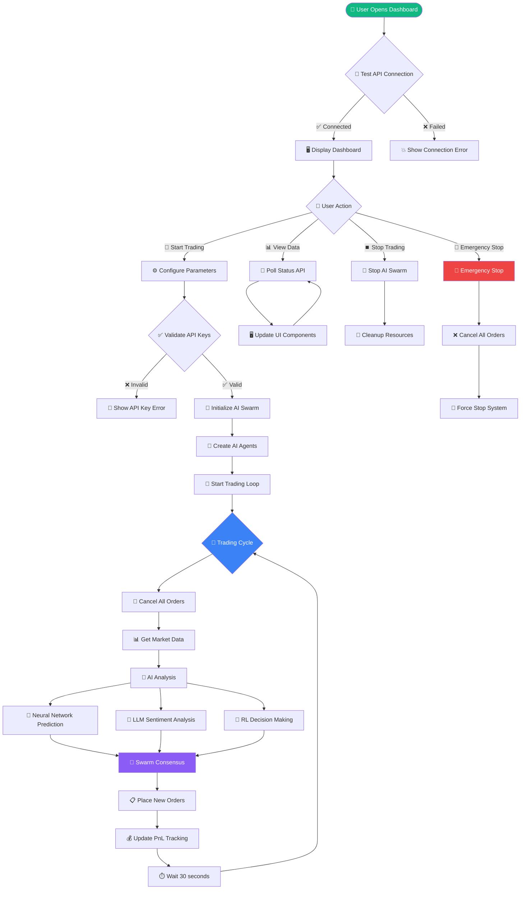
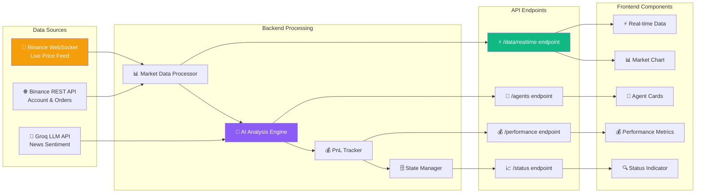
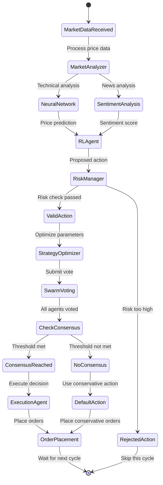
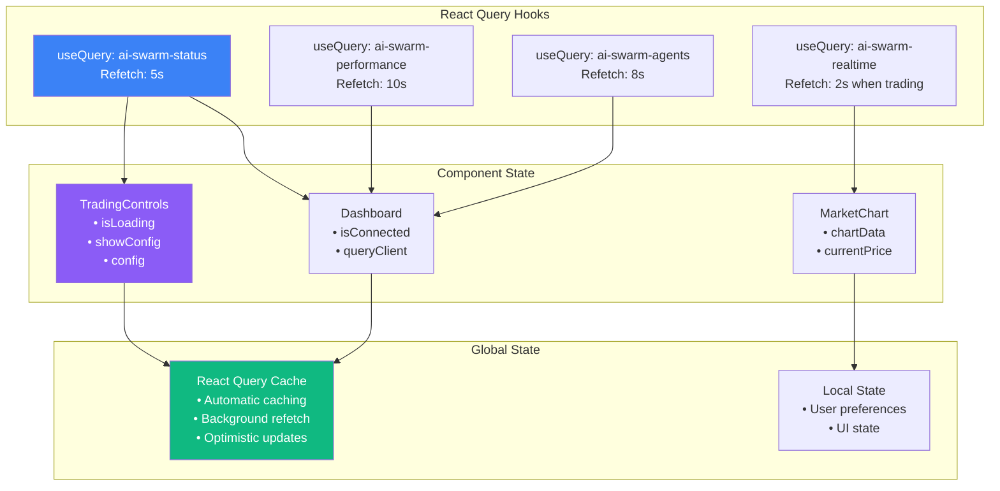
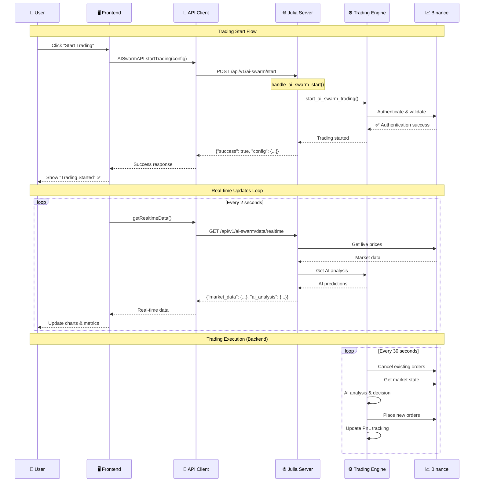
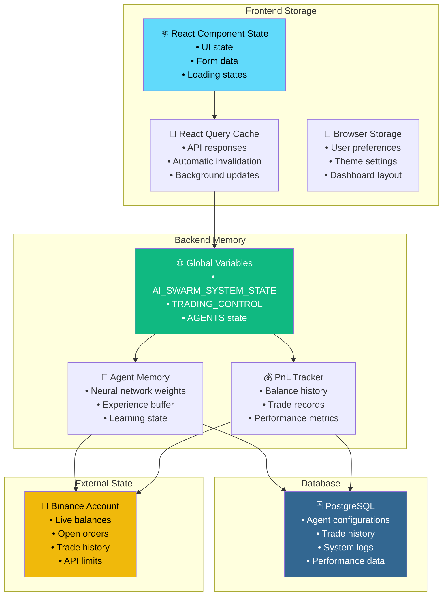

# 🔄 **Step-by-Step Execution Flow**

## 🚀 **Complete Trading Session Flow**

## 📊 **Real-time Data Pipeline**

## 🤖 **AI Agent Decision Making Process**

## 📱 **Frontend State Management Flow**

## 🔐 **API Request/Response Flow**

## 💾 **Data Storage Architecture**

This detailed visual guide shows:

1. **🔄 Complete execution flow** from user action to AI trading
2. **📊 Real-time data pipeline** showing how data flows through the system
3. **🤖 AI decision-making process** with state transitions
4. **📱 Frontend state management** using React Query
5. **🔐 API request/response sequences** with timing
6. **💾 Data storage architecture** across all layers

The diagrams illustrate exactly how your frontend connects to the backend and how real-time AI trading strategies execute with live market data!
